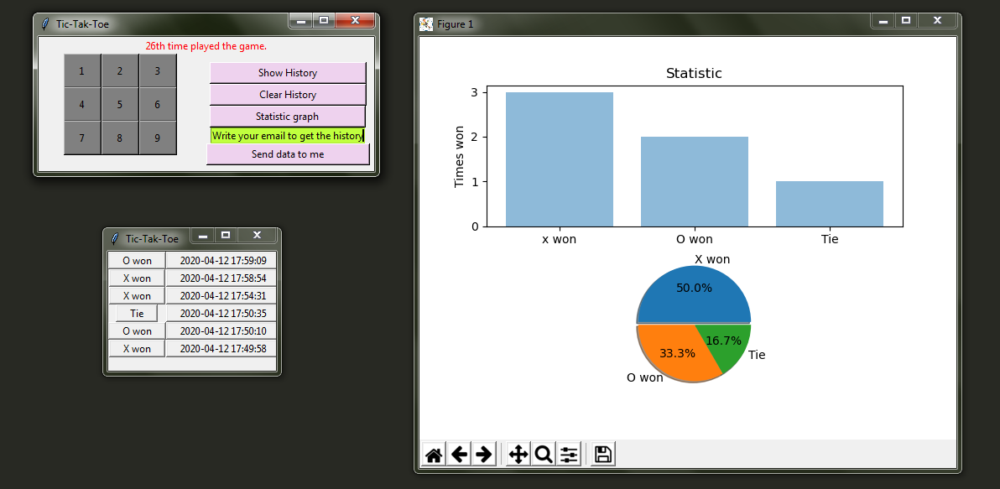
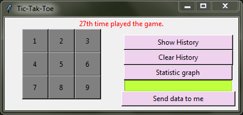
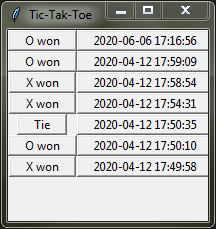
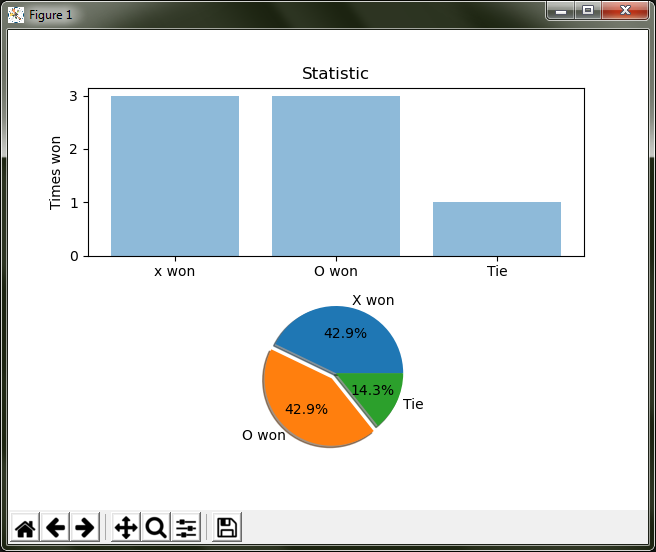

# tic-tak-toe-3

## which is nothing but tictaktoe game + GUI + included mysql database + data representation with the help of bar chat and pie chart.

## as you can see in the dashboard.
## one side the game board and the other there are many features.

## 1-show history-which is display all history of winners 2.clear history-clear all the history.
## and for storing the history in the game play i have used mysql database.

## 3 statistic graph -- which is analysis of the history.
## data representation part is done by matlibplot which python library

## at last the E-mail feature .by this you can get the history of game play by entering the email add of yours.

